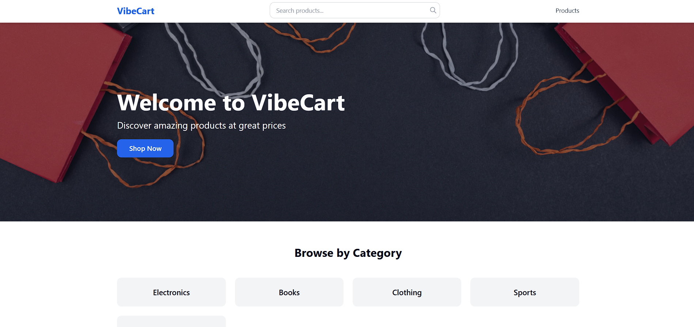
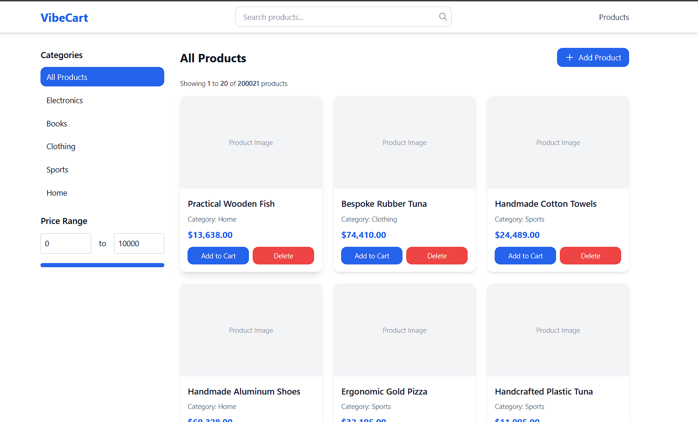
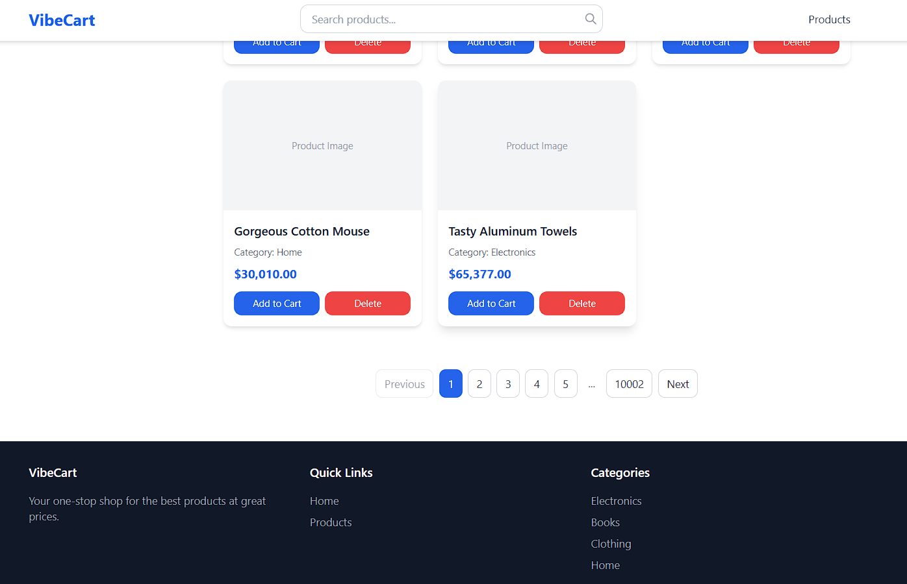
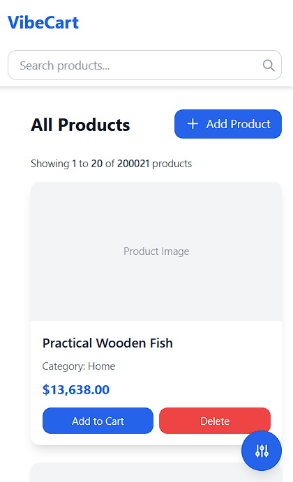
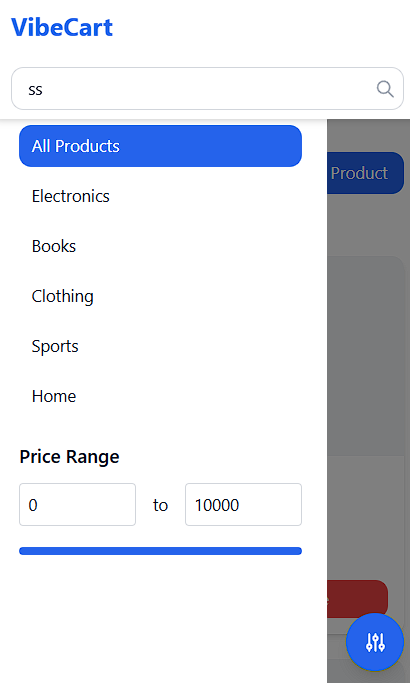
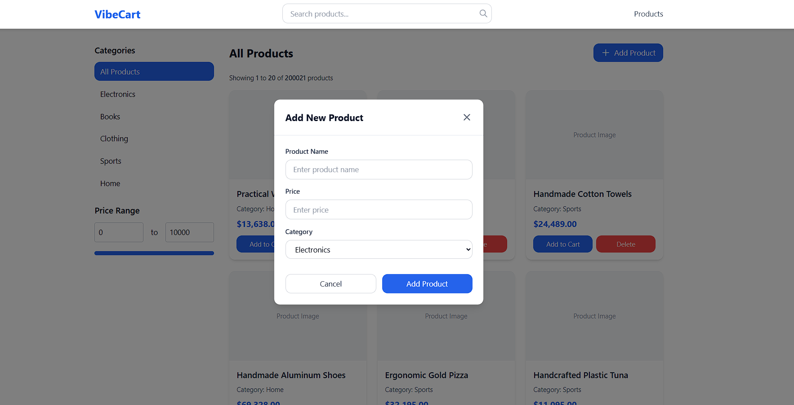
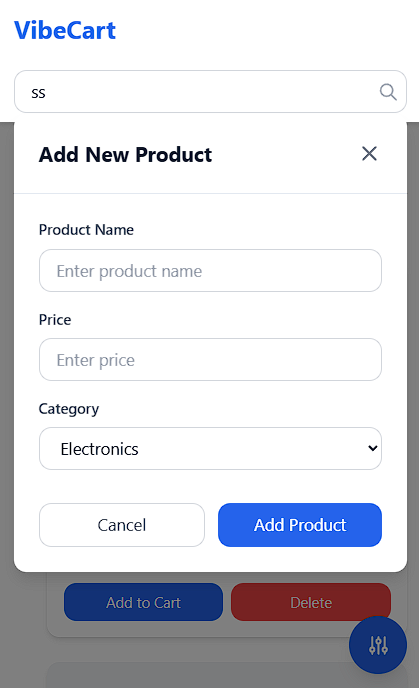

# CodeVector-Internship-Demo

This project demonstrates scalable product listing, filtering, search, **cursor-based pagination** with a clean and responsive UI.

The main focus of this project was to build an optimized product browsing experience with efficient backend APIs and smooth frontend interactions.


# 🧠 Architecture Overview

Frontend (React + Tailwind CSS)
↓ Axios
Backend (Node.js + Express.js)
↓
Database (Supabase - PostgreSQL) 

---

# 🚀 Tech Stack

## Frontend

* React.js
* Tailwind CSS
* Axios
* React Router

## Backend

* Node.js
* Express.js

## Database

* PostgreSQL
* Raw SQL Queries using `pg` library

## Other Concepts

* Cursor-based Pagination
* Dynamic Filtering
* Search
* Category Filtering
* Price Range Filtering
* Responsive Design

---

# ✨ Key Features

* Product listing
* Product filtering by category
* Product search
* Price range filtering
* Cursor-based pagination
* Add product functionality

---

# 💻 API Endpoints

| Method | Endpoint                                  | Description                                             |
| ------ | ----------------------------------------- | ------------------------------------------------------- |
| GET    | `/api/v1/products`                           | Fetch all products with filtering and cursor pagination |
| GET    | `/api/v1/products?categories=Electronics`    | Filter products by category                             |
| GET    | `/api/v1/products?search=phone`              | Search products by name                                 |
| GET    | `/api/v1/products?minPrice=100&maxPrice=500` | Filter products by price range                          |
| GET    | `/api/v1/products?cursor=encodedCursorValue` | Fetch next batch of products using cursor               |
| POST   | `/api/v1/products`                           | Add new product                                         |
| DELETE   | `/api/v1/products`                           | delete existing product  product                                         |

---

# 📦 Product Fetch API Features

The products API supports:

* Category filtering
* Search by product name
* Price filtering
* Cursor pagination

Example:

```bash
GET /api/products?categories=Electronics,Books&search=laptop&minPrice=500&maxPrice=2000
```

---

# ⚡ Pagination Strategy

This project uses **cursor-based pagination** instead of offset pagination.

Why cursor pagination?

* Better performance for large datasets
* Faster than OFFSET/LIMIT for big tables
* Reduces database scan overhead
* Scales better for production systems

Pagination is implemented using:

```sql
ORDER BY updated_at DESC, id DESC
```

Cursor stores:

* `updated_at`
* `id`

This ensures stable and efficient pagination.

---

# 📈 Performance Optimizations

* Efficient SQL filtering
* Reduced unnecessary queries
* Cursor-based pagination using PostgreSQL
* Optimized product fetch query

---

# 🔮 Future Improvements

## 1. COUNT Query Optimization

Currently, total product count is calculated using:

```sql
SELECT COUNT(*) FROM products
```

For large-scale production systems, this can become expensive.

Possible improvements:

* Approximate counts
* Cached counts
* Background aggregation
* Infinite scroll without exact counts

---

## 2. Database Indexing

Indexes can be improved for faster filtering:

Recommended indexes:

* `category`
* `price`
* `(updated_at, id)`

Example:

```sql
CREATE INDEX idx_products_updated_id ON products(updated_at DESC, id DESC);
```

---

## 3. Caching Layer

Introduce:

* Redis caching
* API response caching
* Query result caching

This would significantly improve performance under high traffic.

---

# 🖼️ UI Gallery

## 🏠 Home Page

### Desktop View


### Mobile View


---

## 🛍️ Products Page

### Desktop View



### Mobile View


---

## 🎛️ Filters

### Mobile View


---

## ➕ Add Product

### Desktop View


### Mobile View


---


# 👨‍💻 Developer

**Shailesh Prajapati**

📩 Email: [prajapatishailesh4941@gmail.com](mailto:prajapatishailesh4941@gmail.com)
🐙 GitHub: https://github.com/Shailesh7026/

Built with ❤️ using React, Node.js, Express, and PostgreSQL.
